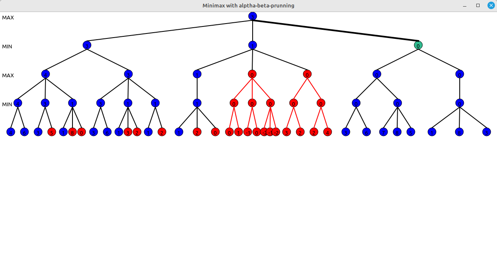
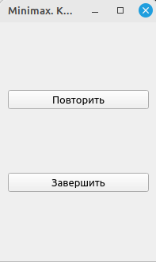

# Визуализация алгоритма Minimax на дереве поиска #
### Описание ###
Программа представляет из себя визуализацию алгоритма **Minimax** на дереве поиска. Данный проект упрощает понимание работы алгоритма **Minimax** c методом Альфа-Бета отсечений.

**Minimax** - это алгоритм принятия решений, используемый в теории игр и ИИ. Он помогает определить оптимальный ход игрока в двухпользовательской игре, рассматривая все возможные исходы игры.

**Работа минимакса** заключается в рекурсивной оценке всех возможных ходов, которые могут сделать текущий игрок и игрок-соперник. Алгоритм начинается с корня дерева игры и применяет minimax к каждому дочернему узлу.
На каждом уровне дерева алгоритм чередует минимизациюю с максимизацией.

**Правило минимакса** как раз и означает, что мы стремимся минимизировать максимально возможный проигрыш.

**Реализация алгоритма минимакса** основана на алгоритме ***DFS***, т.е. мы проходим дерево в глубину, рекурсивно обрабатывая каждый узел.

**Альфа-бета отсечение** - это метод оптимизации алгоритма minimax, который позволяет игнорировать некоторые ветви в дереве поиска. Это позволяет намного глубже оценить дерево поиска, используя те же ресурсы. Это метод оптимизации, который позволяет отсекать те ветви дерева поиска, где гарантировано будут невыгодные ходы (хуже всех уже найденных)

*альфа* - наилучшее значение, которое игрок MAX может гарантировать на текущем уровне или выше.\
*бета* - наилучшее значение, которое игрок MIN может гарантировать на текущем уровне или выше.

> Альфа бета отсечение не влияет на результат минимакса, оно только ускоряет его
### Установка ###
1. Скачайте и установие [Qt](https://www.qt.io/offline-installers "Сайт для установки Qt Creator") c официального сайта или с помощью командной строки для Linux Ubuntu под суперпользователем:
    * Установка фреймворка Qt:\
   `apt-get install qt5-base-dev`
    * Установка Qt Creator:\
  `apt-get install qtcreator`
2. Клонируйте репозиторий
    * Сколонируйте репозиторий на свой компьютер:\
    `git clone https://github.com/pick4a-steka/minimaxApp.git`
    * Перейдите в директорию проекта:\
    `cd minimaxApp`
3. Откройте проект в Qt Creator
    * Запустите Qt Creator
    * В Qt Creator выберите ***Файл > Открыть файл или проект и выберите файл проекта `.pro`***, который находится в корневой папке репозитория.
4.  Настройте конфигурацию проекта
    * Qt Creator предложит выбрать компилятор и версию Qt.
5. Скомпилируйте и запустите проект
    * `Ctrl + B` для компиляции проекта
    * `Ctrl + R` для запуска проекта
### Демонстрация ###
Меню для ввода стартовых параметров для алгоритма Minimax и дерева поиска:\

Анимированная работа алгоритма Minimax на дереве поиска:\

Меню контроля перезапуска-завершения работы алгоритма:\

